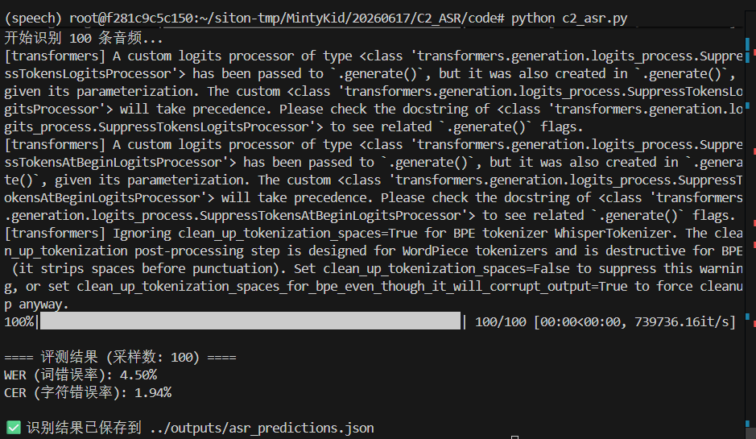
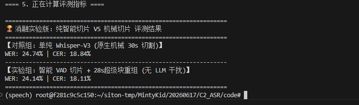
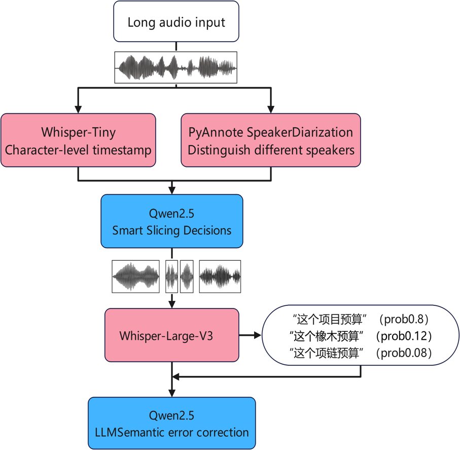
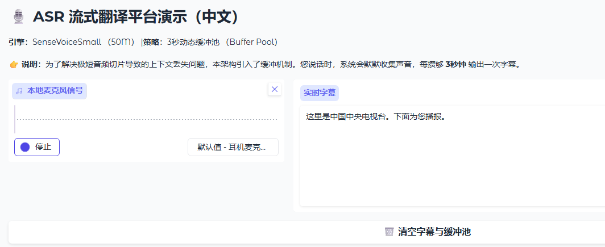
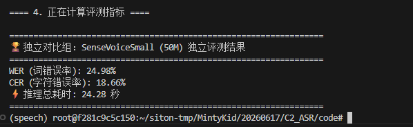
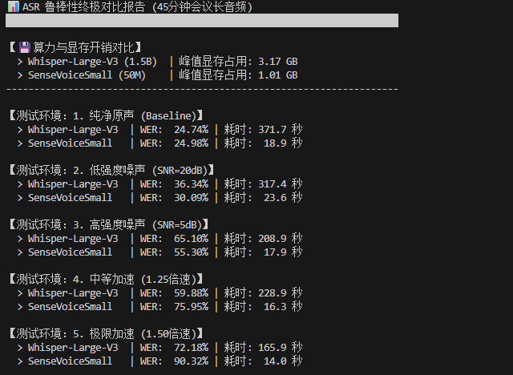
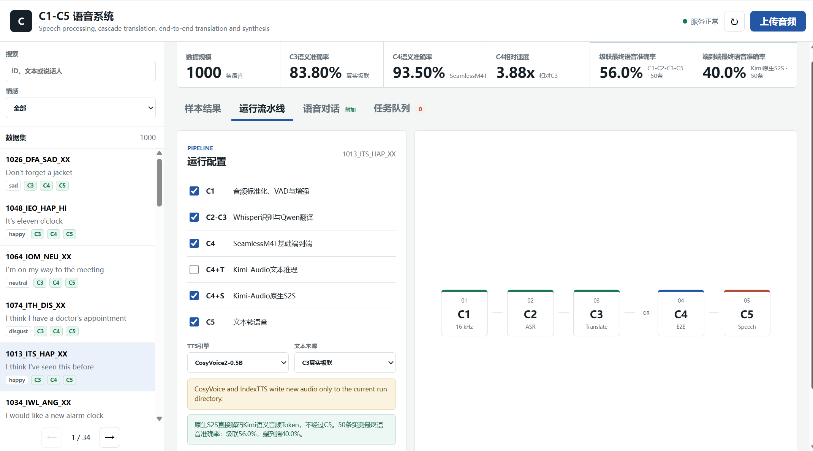

# 个人模块 README 模板
---
## 1. 模块概述

### 1.1 模块名称

`[ASR语音识别模型推理]`
### 1.2 模块说明
本模块（C2 ASR 语音识别）位于级联语音翻译系统的核心流水线前端，将原始音频转换为文本，为后续的翻译与合成模块提供基础数据支持。
1. 系统层级与核心职能
C2 模块属于系统架构中的感知与转录层。该模块的功能是从原始音频波形中提取语义信息。它将非结构化的语音信号转化为结构化的文本序列，为后续模块的深度处理提供标准输入。如果没有本模块的准确转录，后续模块将无法获得有效的处理对象，从而导致级联翻译任务的逻辑中断。
2. 数据输入与处理链路
输入维度：模块接收来自 C1 音频预处理模块的标准化音频文件。这些输入已经过重采样、静音裁剪及峰值归一化处理，保证了输入音频在时域和幅值上的稳定性。此外，模块还同步接收对应的标准参考文本，用作模型推理结果的客观评价依据。
输出维度：模块输出识别出的预测文本。在生产环境中，该输出不仅是简单的文本字符串，还伴随有模型置信度得分。同时，本模块输出完整的 WER（词错误率）及 CER（字符错误率）评测报告，这些统计数据通过 JSON 格式持久化存储，供实验记录分析。

### 1.3 完成情况概览

| 类型 | 完成情况 |
|---|---|
| 基础要求 | `[Whisper-Large-V3语音识别模型推理]` |
| 进阶要求 | `[加入VAD切分和支持长音频的识别，支持流式翻译功能，同时比较了whisperV3模型和SenseVoiceSmall模型在不同噪声条件和音频速度下的鲁棒性测试，比较了不同模型在显存，计算速度和词错误率下的权衡]` |
| 可独立运行的演示 | `[python final_compare.py(基础部分) python app.py (流式翻译) python robustness_test.py (鲁棒性测试) python compare_sensevoice.py(比较SenseVoiceSmall和whisperV3模型错误率)  ]` |
| 与团队系统集成情况 | `[在系统中调用相关ASR模型进行音频转文字的操作]` |

---

## 2. 环境、模型与数据依赖

### 2.1 运行环境

| 项目 | 要求 |
|---|---|
| Python 版本 | `python 3.10` |
| 必要依赖 | `torch librosa numpy jiwer tqdm` |
| 是否需要模型 | `需要` |
| 是否需要 GPU | `需要` |
| 是否需要外部数据集 | `需要` |

### 2.2 模型依赖
| 模型 | 来源 | 项目内相对路径 | 用途 |
|---|---|---|---|
| `[Whisper-Large-V3]` | `[OpenAI / Hugging Face(https://huggingface.co/openai/whisper-large-v3)]` | `[../whisper-large-v3/]` | `[核心声学推理大模型，负责高质量的语音转文字（ASR）解码]` |
| `[Whisper-Tiny]` | `[OpenAI / Hugging Face(https://huggingface.co/openai/whisper-tiny)]` | `[../../whisper-tiny/]` | `[轻量级声学引导模型，用于超长音频的前置处理，极速提取单词级时间戳特征]` |
| `[PyAnnote SpeakerDiarization]` | `[pyannote / Hugging Face(https://huggingface.co/pyannote/speaker-diarization-3.1)]` | `[../pyannote_models/]` | `[负责语音活动检测（VAD）与说话人声纹聚类分离，为智能切片算法提供说话人切换边界]` |
| `[Qwen2.5。]` | `[Alibaba Qwen / Hugging Face(https://huggingface.co/Qwen/Qwen2.5-1.5B-Instruct)]` | `[../Qwen2.5-1.5B-Instruct/]` | `[用于端侧离线状态下的 ASR 文本级语法纠错与语义级平滑处理（在级联方案中扮演云端 LLM 的本地替代者）]` |
```bash
```
### 2.3 数据集或样例数据依赖
| 数据或文件 | 来源 | 项目内相对路径 | 用途 |
|---|---|---|---|
| `[TESS]` | `[Kaggle 开源下载(https://www.kaggle.com/datasets/ejlok1/toronto-emotional-speech-set-tess)]` | `[../common_data/TESS/]` | `[包含大量带有情绪标签的清晰语音，主要用于测试系统或声学模型在不同情绪波动、语调变化下的识别鲁棒性与声纹提取能力]` |
| `[AMI]` | `[官方开源获取(https://groups.inf.ed.ac.uk/ami/corpus/)]` | `[../common_data/]` | `[核心长音频验证集（EN2001a.Mix-Headset.wav），这是真实的 45 分钟多人嘈杂会议录音。用于极限测试 ASR 模型（Whisper/SenseVoice）在长程上下文、重叠音、多说话人场景下的抗截断能力与转写准确率（WER）]` |
```bash
```

### 2.4 安装步骤

```bash
# 1. 进入工作目录并激活环境
cd /root/siton-tmp/MintyKid/20260617/C2_ASR/code
conda activate speech
# 2. 基础深度学习底座与矩阵计算
pip install torch torchvision torchaudio numpy scipy
# 3. 核心音频处理库 (负责重采样、加载与保存)
pip install librosa soundfile
# 4. Hugging Face 生态 (WhisperV3, Tiny, PyAnnote VAD)
pip install transformers pyannote.audio 
# 5. 阿里 SenseVoice 
pip install funasr modelscope
# 6. Web 交互界面与进度条
pip install gradio tqdm
# 7. 评测指标计算 (WER / CER)
pip install jiwer
# 8. 云端大模型纠错与 SSH 穿透网络请求
pip install openai httpx

```

---

## 3. 文件结构与接口边界

### 3.1 文件结构
```text
project_root/
├── C2_ASR/
│   └── code/
│       ├── app.py #流式翻译网站
│       ├── build_ami_groundtruth.py #构建AMI数据集
│       ├── c2_asr.py #C2基础内容
│       ├── compare_sensevoice.py #测试SenseVoiceSmall对比
│       ├── evaluate_pipeline.py #测试加入VAD切分的whisper模型
│       ├── final_compare.py #最终对比两个模型
│       ├── generate_realistic_test.py 
│       ├── make_long_audio.py #测试使用
│       ├── prepare_data.py #数据准备
│       ├── robustness_test.py #鲁棒性测试代码
│       ├── run_smart_slicing.py #测试使用（音频切分）
│       ├── test_pyannote.py #测试使用
│       ├── test_qwen_slicing.py #测试使用
│       ├── test_tiny.py #测试使用
│       ├── common_data/ #数据准备
│       ├── outputs/
│       ├── SenseVoiceSmall/ #模型文件
│       ├── whisper-large-v3/ #模型文件
│       └── .gitignore
├── distilabel-math-preference-dpo/
├── examples/
├── LlamaFactory/
├── pyannote_models/ #模型文件
├── Qwen1.5-0.5B-Chat/ #模型文件
├── whisper-tiny/ #模型文件
├── archive.tar.gz
└── README.md #模块说明文档
```

### 3.2 接口边界
| 类型 | 来源 / 去向 | 数据格式 | 说明 |
|---|---|---|---|
| 输入 | `[来自C1模块]` | `[统一数据集或自定义音频集]` | `[Whisper 批量英文 ASR，计算 WER/CER]` |
| 输出 | `[传给C5模块]` | `[JSON]` | `[英文翻译]` |
---

## 4. 基础要求实现与演示
### 4.1 基础功能说明
```text
基础功能为调用和使用Whisper-Large-V3模型并对模型的输出进行WER和CER字词错误率进行统计。
```
### 4.2 基础功能实现路径
说明基础功能主要由哪些文件、函数或脚本实现，以及关键流程是什么。
| 文件 / 函数 / 脚本 | 作用 |
|---|---|
| `[c2_asr.py]` | `[调用Whisper-Large-V3模型，读取TESS数据集中的一百条进行测试]` |

```text
[TESS数据输入] -> [加载模型] -> [输出结果] -> [评测WER/CER]
```

```python
# 加载本地 Whisper 模型
asr = pipeline(
    "automatic-speech-recognition",
    model="../whisper-large-v3",
    torch_dtype=torch.float16, # 使用半精度减少显存占用
    device=0
)

refs_norm = [normalize(t) for t in references]
hyps_norm = [normalize(h) for h in hyps]
#计算结果
wer = jiwer.wer(refs_norm, hyps_norm)
cer = jiwer.cer(refs_norm, hyps_norm)
```

### 4.3 基础功能输入格式与样例
| 字段 / 输入文件 | 类型 / 格式 | 是否必需 | 说明 |
|---|---|---|---|
| `TESS音频` | `.wav 格式 (单声道, 16kHz)` | `[否]` | `[用于测试短时情绪语音的独立测试集，非基础流程强依赖]` |
样例输入：
| 样例文件 | 用途 |
|---|---|
| `[/common_data/TESS/OAF_happy_dog.wav]` | `[验证whisper在短音频下的识别效果]` |

### 4.4 基础功能演示命令
```bash
python c2_asr.py
```
评测结果（采样数：100)
WER（词错误率）:4.50%
CER(字符错误率):1.94%

### 4.5 基础功能输出格式
| 输出文件 / 返回字段 | 格式 | 说明 |
|---|---|---|
| `[outputs/asr_predictions.json]` | `[JSON]` | `[翻译的英文输出]` |

### 4.6 基础功能结果截图

---
## 5. 进阶要求实现与演示

### 5.1 选择的进阶要求
| 进阶要求 | 是否完成 | 对应文件 / 函数 | 简要说明 |
|---|---|---|---|
| `[加入VAD切分]` | `[是]` | `[final_compare.py]` | `[引入Whisper-Tiny与PyAnnote提取时间戳与声纹，将机械切分升级为基于自然语义边界的智能切片，并动态重组为28s音频块，消减单词截断与模型幻觉。]` |
| `[支持长音频识别]` | `[是]` | `[final_compare.py]` | `[在VAD的基础上成功支撑 45 分钟 AMI 真实会议长音频推理]` |
| `[支持流式识别]` | `[是]` | `[app.py]` | `[基于 SenseVoiceSmall 构建了实时 WebUI 交互平台。建立3.0秒动态缓冲池与前置音量过滤，解决了极短流式切片导致的上下文丢失与底噪乱码。]` |
| `[比较不同ASR模型]` | `[是]` | `[compare_sensevoice.py]` | `[跨架构对比了Whisper-Large-V3与SenseVoiceSmall，分析两者在批处理与高并发低延迟场景下的工程适用性。]` |
| `[鲁棒性测试]` | `[是]` | `[robustness_test.py]` | `[引入不同级别的噪声和对AMI实验音频的不同程度的加速进行压测。对比了模型在恶劣环境下的边界响应与抗崩塌能力]` |
| `[比较模型大小、速度、显存和 CER/WER 之间的权衡]` | `[是]` | `[robustness_test.py]` | `[在引入不同级别的噪声和对AMI实验音频的不同程度的加速进行压测。对比了模型在恶劣环境下的正确率，运行速度和显存占用]` |

### 5.2 进阶功能 1，2：`[加入VAD切分/支持长音频识别]`
#### 功能说明
```text
原生Whisper大模型在处理超长音频时，底层采用的是切割方式鲁棒性差，机械30秒一刀切的粗暴切割经常会正好切断演讲者的半个单词或半句话，导致大模型基于残缺的上下文产生严重的“重复幻觉”与“吞字漏句”。本进阶功能引入了轻量级Whisper-Tiny与声纹大模型 PyAnnote作为前端VAD探测器。在人类自然的标点停顿处或说话人切换处进行“物理剪切”，随后通过动态打包算法，加入0.1秒静音垫片，将碎片粘合成最贴合 GPU 算力极限的“28 秒音频块”。缓解了单词截断带来的幻觉问题，还为团队下游的LLM纠错和RAG问答模块提供了极高质量的“生肉”文本，避免了垃圾输入导致垃圾输出。支持45min会议多人音频识别。
```
#### 实现路径
| 文件 / 函数 / 脚本 | 作用 |
|---|---|
| `[final_compare.py]` | `[引入Whisper-Tiny与PyAnnote提取时间戳与声纹，将机械切分升级为基于自然语义边界的智能切片，并动态重组为28s音频块，消减单词截断与模型幻觉。]` |
```text
[输入] -> [whisper-tiny粗翻译与字词级别时间戳] -> [PyAnnote说话人识别] -> [输出对齐] -> [WhisperV3]
```
#### 输入格式与样例
| 字段 / 输入文件 / 配置项 | 类型 / 格式 | 是否必需 | 说明 |
|---|---|---|---|
| `[音频]` | `[.wav]` | `[是]` | `[取自AMI长音频]` |
#### 演示命令
```bash
python final_compare.py
```
### VAD切分与长音频识别功能结果截图




### 5.3 进阶功能 3：`[支持流式识别]`
#### 功能说明
```text
在真实的实时语音交互场景中，前端麦克风会极其频繁地发送几十毫秒的极短音频碎片。如果直接将这些碎片送入ASR大模型，会导致大量字词被硬生生切断，引发严重的上下文丢失与底噪“幻觉”（如模型在安静时强制输出乱码）。
本进阶功能基于阿里SenseVoiceSmall轻量模型构建了流式 WebUI 交互平台。系统建立了“3.0 秒动态缓冲池”策略，在内存中默默收集声音碎片，攒够 3 秒后配合前置音量门限过滤再进行完整推理。这一架构平衡了“流式低延迟”与“上下文完整性”，消除了模型在底噪中强行识别产生的幻觉标签，实现了极速、高可用的实时转写。
```
#### 实现路径
| 文件 / 函数 / 脚本 | 作用 |
|---|---|
| `[app.py]` | `[负责构建基于 Gradio 的实时 Web 服务，维护全局音频队列状态（gr.State），并实现缓冲池的累加、音量过滤、重采样与极速推理逻辑。]` |
```text
[前端流式麦克风] -> [进入3秒动态缓冲池攒数据] -> [静音过滤与16kHz强制重采样] -> [SenseVoice极速推理] -> [剔除模型幻觉标签与标点清洗] -> [Web UI 实时追加字幕]
```

#### 输入格式与样例
| 字段 / 输入文件 / 配置项 | 类型 / 格式 | 是否必需 | 说明 |
|---|---|---|---|
| `[麦克风音频流]` | `[Float32 Numpy Array]` | `[是]` | `[由 Gradio 前端实时传入的音频碎片，底层代码会自动将其双声道均值化并对齐至 16kHz 采样率。]` |
#### 演示命令
```bash
python app.py
```
### 流式识别结果截图


### 5.4 进阶功能 4，5，6：`[不同ASR模型对比和鲁棒性测试对比]`
#### 功能说明
```text
基础版本仅验证了 Whisper 在理想状态下“能跑通”长音频，但缺乏真实工业落地视角的全面评估。本功能糅合了长音频管控与流式部署的技术积累，构建了鲁棒性压测管线。系统抽取了重资产离线管线Whisper-Large-V3(1.5B)与极速轻量流式引擎SenseVoiceSmall(50M)进行跨架构对比。测试数据选取45分钟的AMI嘈杂会议录音以验证“抗 OOM 崩溃与抗死锁能力”，通过全面捕获端到端耗时、GPU 显存峰值占用与 WER/CER，深度剖析了模型大小、速度、显存与准确率之间的工业级权衡，为团队完整系统的引擎选型提供了硬核的数据支撑。
```
#### 实现路径
| 文件 / 函数 / 脚本 | 作用 |
|---|---|
| `[compare_sensevoice.py]` | `[负责拉起双引擎（Whisper 批处理流水线 vs SenseVoice 流式缓冲池），并结合 jiwer 与 torch.cuda 实时捕获核心评测指标与显存消耗]` |
| `[robustness_test.py]` | `[负责加载离散的极端测试用例，验证模型的底噪识别边界与鲁棒性。]` |
```text
[加载多样化压测语料] -> [Whisper/SenseVoice] -> [后台实时监控显存占用与推理耗时] -> [比对Ground Truth计算 WER/CER] -> [输出性能权衡报告]
```
#### 输入格式与样例
| 字段 / 输入文件 / 配置项 | 类型 / 格式 | 是否必需 | 说明 |
|---|---|---|---|
| `[AMI长音频压测集]` | `[.wav (16kHz 单声道)]` | `[是]` | `[EN2001a.Mix-Headset.wav，用于验证长时间高负载下，系统是否会发生显存泄漏或产生长程截断幻觉。]` |
#### 演示命令
```bash
# 运行双引擎长音频综合性能对比测试 (包含耗时、显存、WER 对比)
python robustness_test.py
```

### 模型对比结果截图



---

## 6. 与团队系统的集成说明
1. 团队系统调用模块
独立测试调用：可以通过 C2_ASR/code/c2_asr.py 进行独立的批量离线推理。
团队系统集成调用：在完整的网页系统与任务队列中，由 common_data/system_pipeline/pipeline_worker.py 调度。
合并调用优化：在系统的实际级联运行路线中，由于逻辑上 C2（ASR）与 C3（翻译）是前后序关系，整体 UI 为了避免重复加载模型并节省 GPU 显存，选择了一次性调用 c3_cascade.py。该脚本在内部连贯完成 Whisper 语音识别（C2 的核心任务）与 Qwen 翻译，并在运行中把 ASR 的中间结果剥离，专门保存到本次任务的 c2/ 目录中，从而在逻辑上维持了模块的独立输出。
2. 调用时传入参数或文件
无论是独立运行还是流水线调度，C2 模块主要接收以下输入：
数据清单文件：--dataset common_data/dataset.json（统一数据契约，包含样本 ID、真实文本等）。
音频文件：C1 模块预处理完毕的 16 kHz 单声道英文语音（如 common_data/audio/*.wav）。
模型路径：--model 指定本地权重路径（如 C3_cascade/whisper-small-hf）。
控制参数：
--n：本次处理样本数。
--batch_size：GPU 批大小。
--outdir：输出结果目录。
--offline：强制使用本地离线模型，不请求网络。
3. 返回结果
C2 模块处理完毕后，会在指定的输出目录（如 C2_ASR/outputs/ 或流水线的 runs/<run_id>/c2/）生成以下结构化结果：
asr_predictions.json：包含核心识别结果的 JSON 文件，记录了每个样本的 id、英文参考文本以及 ASR 预测出的英文文本。
c2_summary.json：包含模型性能与运行状态的汇总文件，记录了 WER（词错误率）、CER（字符错误率）、处理的样本总数以及总耗时。
4. 配置文件、模型、数据集或中间文件
模型依赖：需要本地模型权重。独立运行时可使用 Whisper-Large-V3；在集成流水线中，为了节省资源，复用了预置在 C3_cascade/whisper-small-hf/ 目录下的 Whisper-small 模型。
数据集依赖：必须依赖 common_data/dataset.json 作为统一的输入和结果对齐基准。
中间文件：需要读取上游 C1 模块输出的 16 kHz 规范化音频；同时，C2 自身生成的 asr_predictions.json 会作为中间文件，直接被下游的 C3（翻译模块）和 C4（对比评测模块）读取使用。
5. 联调时遇到过什么接口不一致问题，以及如何解决
根据文档记录的系统现状与已知问题，C2 模块在联调中遇到过以下整合与接口问题：
问题 1：模型加载冗余与显存冲突
现象：C2 与 C3 原本为两个独立模块，如果流水线先后独立拉起这两个模块，会导致多次加载模型，在单 GPU（24GB）环境下极易引发显存不足或串行等待过长。
解决：修改了集成策略，在流水线代码（pipeline_worker.py）中不单独调用 C2，而是通过调用 c3_cascade.py 一并完成 ASR 和翻译任务，并将生成的 ASR 结果分拆保存，既解决了显存瓶颈，又保持了数据产出的独立性。
问题 2：超大模型权重未纳入版本控制
现象：C2 独立的 Whisper-Large-V3 模型体积过大，未放入 assignment_C 仓库中，导致其他成员或服务器拉取代码后无法直接运行最优性能的 C2。
解决：当前的整体集成路线选择复用体积较小的 Whisper-small；并在文档中作为“待改进方向”记录，后续计划补充本地 Large-V3 权重，并在 UI 中提供下拉框以支持 ASR 模型的动态切换。

### 系统整体截图

---

## 7. 已知问题与后续改进
| 问题 | 当前原因 | 后续改进 |
|---|---|---|
| `[进阶原生 S2S 路线最终语音准确率（40.0%）反低于级联路线（56.0%）]` | `[语义音频 Token 存在过长、内容重复、指令泄漏问题，且当前 Flow-Matching 和 BigVGAN 解码器成为将“语义优势”转化为“波形优势”的新瓶颈。]` | `[调整音频停止条件与解码参数，增加 Token 质量筛选；对文本/音频双流增加同步约束，或替换为更稳定的原生音频解码器。]` |
| `[单 GPU 架构下多模型任务存在串行等待瓶颈]` | `[多路线模型共同争抢单卡 24 GB 显存，导致资源互斥，部分大模型（如 Kimi S2S）甚至需要分阶段加载和释放。]` | `[引入更精细的 GPU 资源调度逻辑与模型常驻策略；长远规划多卡部署，将轻量级模型与大模型拆分到不同微服务上运行。]` |
| `[统一运行环境存在版本漂移与冲突风险]` | `[基础架构 requirements.txt 固定依赖旧版本，但当前集成环境版本已变；且引入 Kimi 后其依赖的 PyTorch 版本与服务器现有 CUDA 环境存在冲突。]` | `[导出严格可复现的 Conda lock 文件；将 Kimi 与基础模块拆分为独立的物理环境，并在任务 Worker 中动态配置环境运行路径。]` |

